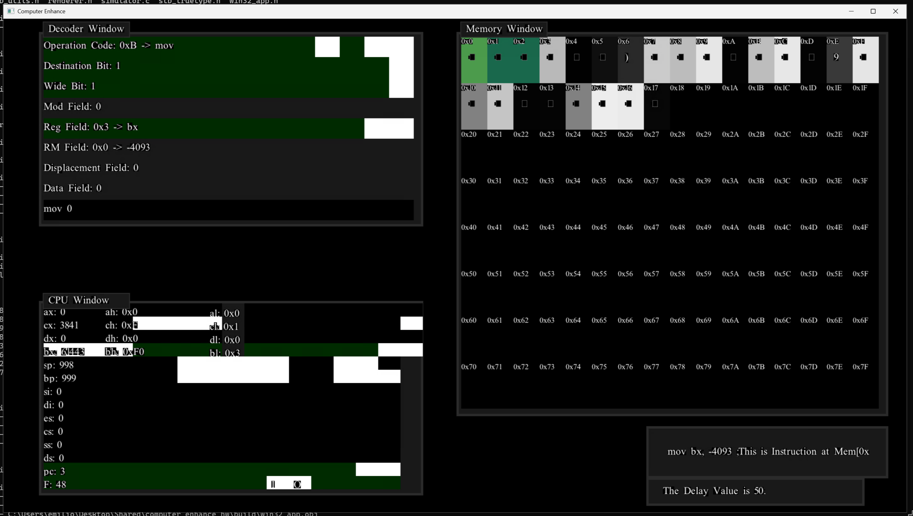

# **COMPUTER ENHANCE**

This repo is a demonstration of my homework for Computer Enhance.
As of right now this is the results of only Part 1 of the course.

In the first section the basic assignment goes as the following, here
is an initial reference manual, make a simulator for it.

I went one step further by introducing cross-platform capabilities,
a graphical user interface view and basic debugger-like capabilities,
such as stepping, memory view and reverse stepping where the user can
go backwards to a previous state that the debugger had the program paused in.

Since the course is paid, the homework content is private so to test the simulator
you will have to provide your own assembly code file at the moment and update the
reference file path in 8086_decoder.h #define TEST_FILE.



> [!NOTE]
> If you install the latest version, there will be no gui interface.
> The reason is explained on commit [#7b691a5](https://github.com/EmilioBenavente/computer_enhance_hw/commit/7b691a58ad510d7d343f675b358b3e9e79175bb9)


## Building And Running For Windows

Download this project's source.

```bash
git clone https://github.com/EmilioBenavente/computer_enhance_hw.git
```

Download MSVC (Window's C compiler) usually through Windows Visual Studio Community Edition,
then ticking the Desktop development section on the Visual Studio Installer


Once MSVC is installed, tell MSVC which version of the compiler it should be
using by running this command.

```bash
VCVARSALL.bat x64
```

Finally, Compile the application

```bash
cd \computer_enhance\code\
win32_build.bat
```

You can now run the application using this command

```bash
..\..\build\win32_enhance.exe
```

# linux

Download this project's source.

```bash
git clone https://github.com/EmilioBenavente/computer_enhance_hw.git
```

This project use's gcc as the C Compiler.

Once gcc is installed you can run this command to compile the application.


```bash
cd ./computer_enhance/code/
./linux_build.sh
```

You can now run the application using this command

```bash
../../build/a.exe
```

